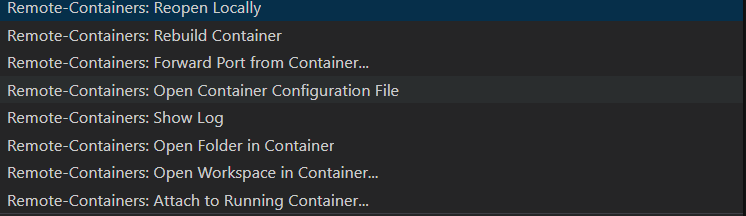

# Maxibon Kata in Python

The idea of this kata comes from [Karumi's Maxibon Kata](https://github.com/Karumi/MaxibonKataJava). In this
repo we use Python and Hypothesis to work on this kata.

## Installation instructions

* Install Python3 and development packages on your machine. Instructions for Ubuntu/Debian:

    ```bash
    sudo apt install python3
    sudo apt install python3-venv
    sudo apt install python-pip
    ```

* Setup local dev environment:
    ```bash
    python3 -m venv .
    source ./bin/activate
    ```

* Install pytest locally:

    `pip3 install pytest`

* Install Hypothesis:

    `pip3 install hypothesis`

## Running the tests:

* Showing hypothesis statistics:

    ```bash
    pytest hash.py --hypothesis-show-statistics
    ```

* No statistics:

   ```bash
   pytest hash.py 
   ```
   
   
## Use it on windows

A easy way to use it on windows is using Dockerfile and use the pluging `Remote - Containers` to conect to it.

You only need install de plugin, press the icon:


Select the option to conect to the docker:



and follow previous steps. 